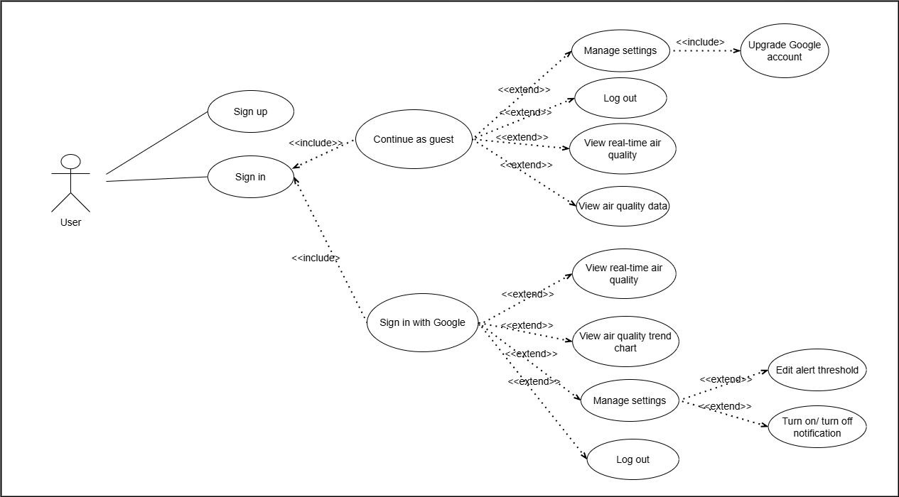

# AirTrack - Air Quality Monitoring Application 🌍

## 1. Introduction
AirTrack is a Flutter-based application that enables users to monitor real-time **PM2.5, CO2, temperature, and humidity** data from IoT sensors.

## 2. Architecture
The application follows the **Clean Architecture + Bloc Pattern**.

### System Architecture
graph TD;
    User["User"]
    
    subgraph Flutter App
        Dashboard["Dashboard Screen"]
        Chart["Chart Screen"]
        Settings["Settings Screen"]
    end

    subgraph Bloc Layer
        AirQualityBloc["AirQualityBloc"]
        SettingsBloc["SettingsBloc"]
    end

    subgraph Domain Layer
        GetAirQualityUseCase["GetAirQualityUseCase"]
        SetAlertThresholdUseCase["SetAlertThresholdUseCase"]
    end

    subgraph Data Layer
        Repository["AirQualityRepository (Interface)"]
        RemoteSource["Remote Data Source (API, MQTT)"]
        LocalSource["Local Data Source (SQLite, SharedPreferences)"]
    end

    subgraph Backend
        API["REST API / WebSocket"]
        Database["PostgreSQL / Firebase"]
    end

    User -->|Interacts| Dashboard
    Dashboard -->|Requests Data| AirQualityBloc
    Chart -->|Requests Data| AirQualityBloc
    Settings -->|Changes Config| SettingsBloc

    AirQualityBloc -->|Uses| GetAirQualityUseCase
    SettingsBloc -->|Uses| SetAlertThresholdUseCase

    GetAirQualityUseCase --> Repository
    SetAlertThresholdUseCase --> Repository

    Repository -->|Fetches Data| RemoteSource
    Repository -->|Stores Data| LocalSource

    RemoteSource -->|Calls| API
    LocalSource -->|Stores in| Database

    API -->|Serves Data| RemoteSource
    Database -->|Stores Data| API

### Bloc Flow


### Use Case


## 3. Technologies Used
- **Flutter** (UI)
- **Bloc Pattern** (State Management)
- **Firebase/MQTT/PostgreSQL** (Backend)
- **Dio** (API Requests)

## 4. Installation & Running the Application
```sh
# Install dependencies
flutter pub get

# Run the application
flutter run
```

