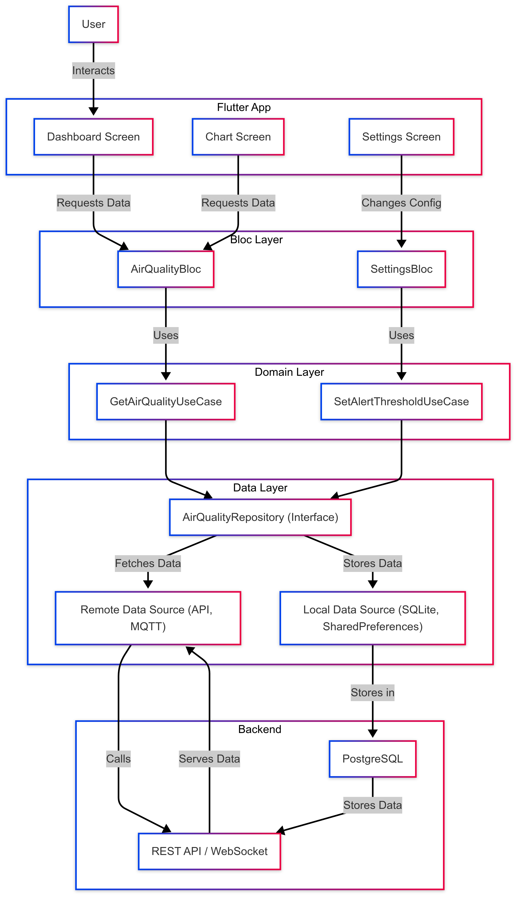

# AirTrack - Air Quality Monitoring Application 🌍

## 1. Introduction
AirTrack is a Flutter-based application that enables users to monitor real-time **PM2.5, CO2, temperature, and humidity** data from IoT sensors.

## 2. Architecture
The application follows the **Clean Architecture + Bloc Pattern**.

### System Architecture


### Bloc Flow


### Use Case


## 3. Technologies Used
- **Flutter** (UI)
- **Bloc Pattern** (State Management)
- **Firebase/MQTT/PostgreSQL** (Backend)
- **Dio** (API Requests)

## 4. Installation & Running the Application
```sh
# Install dependencies
flutter pub get

# Run the application
flutter run
```

