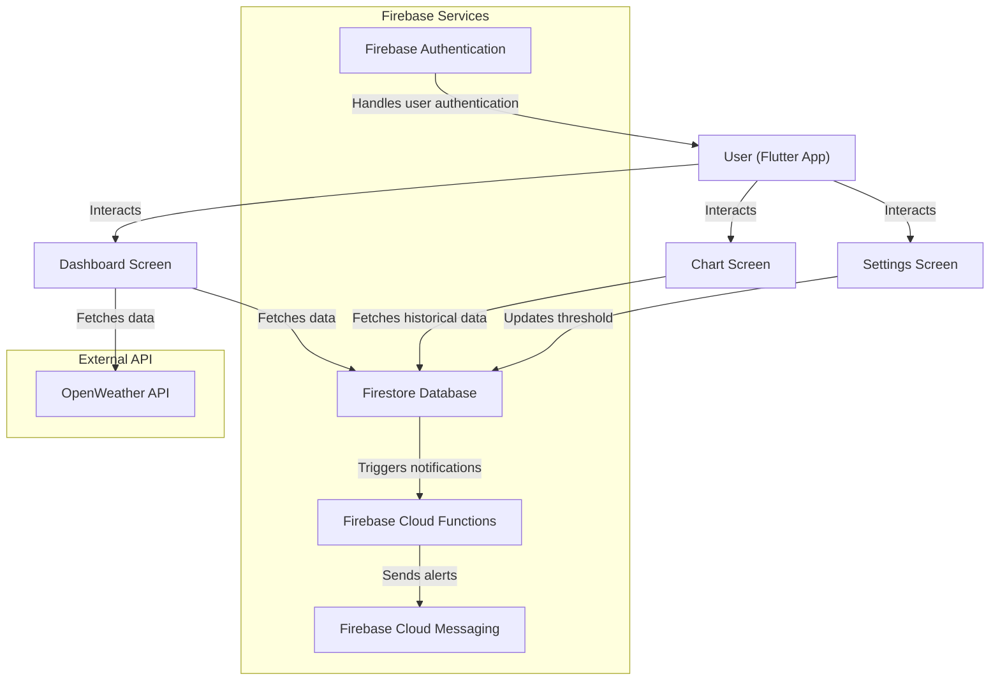
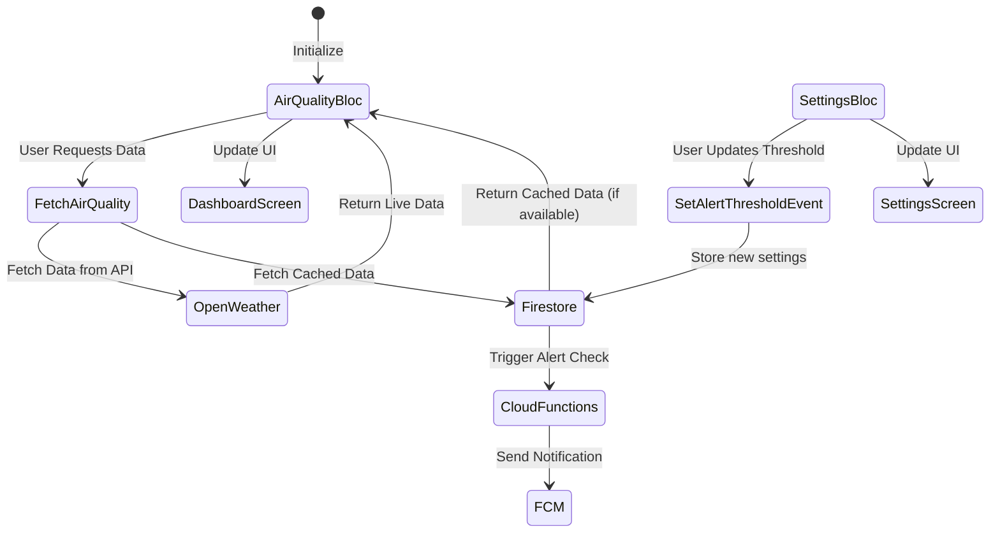

# AirTrack - Air Quality Monitoring Application 🌍

## 1. Introduction
AirTrack is a Flutter-based application that allows users to monitor real-time **PM2.5, CO, NO₂, O₃, SO₂, and other air quality indices** by fetching data from the **OpenWeather API**. 

The app also provides historical data visualization and customizable alert thresholds for air quality monitoring. It supports user authentication via **Google Sign-In** and **Guest Mode**, with data caching for offline access.

## 2. Architecture
The application follows the **Clean Architecture + Bloc Pattern**.

### System Architecture


### Bloc Flow


### Use Case


## 3. Technologies Used
- **Flutter** (UI)
- **Bloc Pattern** (State Management)
- **Firebase** (Backend)
- **http** (API Requests)

## 4. Installation & Running the Application
```sh
# Clone repository
git clone https://github.com/taitran501/air_track.git
cd AirTrack

# Load environment variables
cp .env.example .env

# Install dependencies
flutter pub get

# Run the application
flutter run
```

